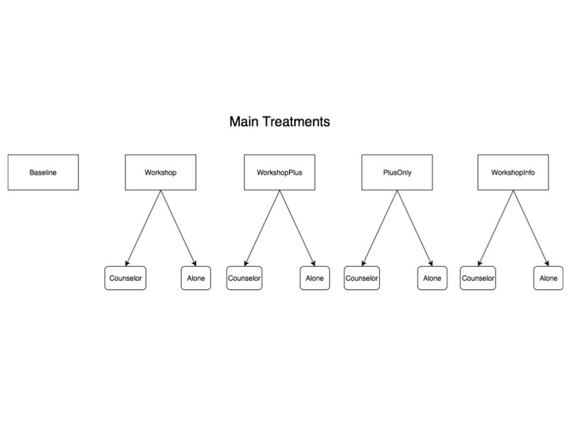

```{r setup, include=FALSE}
## This chunk just sets it so that code will not show up on slides
knitr::opts_chunk$set(echo = FALSE)
```

```{r load libraries, message=FALSE, results='hide', echo=FALSE, warning=FALSE, include=FALSE}
#be warned...it takes a while
rm(list = ls()) #This clears the list databse
library(rticles)
library(tidyverse)
library(haven) #haven is part of tidyverse, but for some reason, this is needed.
library(ggplot2)
library(stargazer)
library(plm)
library(car)
library(cowplot) #plot side-by-side graphs
library(knitr) #to enable kable for testing. 
library(lfe) #To use the 'felm' command to run fixed effect linear models with clustering
```


```{r import data, echo=FALSE}
#Import your data in this code chunk
data1 <- read_dta("./data/final_data1.dta")
data2 <- read_dta("./data/final_data2.dta")
data3 <- read_dta("./data/final_data3.dta")
```


# 1. Introduction
Behavioral economics (BE) uses insights from decision psychology, behavioral game theory, neuroeconomics, and related fields to understand the real-world preferences and choices of economic actors. Time preferences are particularly useful to examine through a BE lens, as most people exhibit preferences over time that are not classically rational (not transitive and consistent over time) and may make immediate choices that do not maximize long-term expected utility, or that lead to predictable regrets. One important application of temporal decision-making is in job search. Our main paper, by @abel_bridging_2019, notes significant differences between what individuals state they intend to do when searching for jobs and their actual behaviors. The paper focuses on young job seekers in South Africa. It reports that many job seekers search for jobs for fewer hours than they intend. It also found that some planning techniques significantly increased the number of applications submitted and the likelihood that job seekers would hear back from employers, although the number of hours spent searching didn’t increase.

Our project furthers Abel et al.’s study by examining the observed intention-behavior gap more closely. Our research question is as follows: What causes the “intention-behavior gap”, and can it be bridged most effectively by altering planning and behaviors via well-defined interventions? We framed this question in terms of trying to carefully observe indicators (stated intentions of goals or subsequent behaviors in executing them) of the underlying cause(s) of the “intention-behavior gap” in order to find the most effective way to bridge it to help job seekers to make more efficient use of their search time. We explore whether intentions or behaviors are more in need of change: do unreasonable expectations fall apart in practice, or does procrastination ruin good intentions (or both)? Our design for testing this question involves a time-series analysis involving looking at job-seekers both before and after our interventions. Specifically, we examine the effects of the following treatments: (a) informational workshops (which affect preparatory job search and change individuals’ job-seeking strategies), (b) workshops that provided employer-specific information (c) career counseling with a professional job-counselor (peer counseling was not found to be particularly useful by Abel et al., but other research suggests that professional counseling may help, particularly as found in a paper by @hoven_job_2016 discussed in our literature review), (d) action-plan creation (which Abel et al. suggested might be most effective for combating procrastination effects brought about by the cognitive load of tackling complex and unfamiliar tasks), and (e) a control group. 

We propose to focus on job-seekers in China in order to not only focus on a different market but also to test the extent that employment-specific information affects job-search. Some literature relevant to our new design was specific to job-search, but in different countries such as Germany. Others had different contexts such as students and procrastination in college, but overall, each grappled with time-inconsistent behavior.

# 2. Summary and Reproduction of @abel_bridging_2019
### Main Conclusions
*Bridging the Intention Gap? The Effect of Plan-Making Prompts on Job Search and Employment* by @abel_bridging_2019 argues that there is an “intention gap” between good intentions and actual behaviors of young job seekers in South Africa: they intend to undertake certain behaviors for seeking jobs, but end up behaving differently in practice, due in large part to psychological and behavioral biases that create dynamic inconsistencies between plans and behaviors over time. The paper tries to “bridge” the gap by applying different treatments to change behaviors. The focus is on “Plan-Making Prompts,” or helping job-seekers to form plans that will lead to more efficient job-search behavior (i.e. dropping off more CVs, increasing the number of job applications, etc.) By increasing the efficiency of job search and increasing the number of job applications submitted, the intervention helps to make job search easier and more likely to lead to employment.

### Methods
The experimental interventions that Abel et al. conducted focused on job seekers in South Africa between the ages of 18 and 35 who had registered with the Employment Services of South Africa and who were able to travel to the Labor Centers where the study was conducted. The sample included 1,097 unemployed youths who were actively seeking work and who spent roughly 11 hours per week on job search but who submitted very few applications (roughly 4.4 in a month). The study randomly assigned participants to one of three main treatments: a control group (Control), a group that attended a workshop (Workshop), and a group that attended a workshop and completed an action plan (WorkshopPlus). The workshops were run by career counselors and covered topics that included job search strategies, CV creation, and interview techniques. They provided information about resources for job search. The action plan group also filled out a chart that encouraged them to think about their schedules and formulate specific, concrete goals for job search and specific tasks they could complete, such as setting a certain number of hours for job search or a number of applications they were planning to submit.

Additionally, there were two sub-treatments. Within the WorkshopPlus group, some individuals were randomly asked to nominate a peer to help them with their search. In the Workshop and WorkshopPlus groups, some participants were randomly assigned to receive text message reminders, either about topics covered in the workshop for the former or about the goals listed in the action plan for the latter. 

Finally, the main paper supplemented the survey data with an observed measure of job search by sending participants a “text message (from a number they could not associate with the research study)” that notified them of an actual vacancy in a specific sector (whenever possible in a sector in which they worked before) (@abel_bridging_2019). It invited them to submit an application to a specific email address which allowed the researchers to observe whether the participants responded to the message and to evaluate the quality of the material submitted.

### Results and Conclusions

The first conclusion the paper drew was that the number of hours spent searching for jobs did not increase in either of the two main intervention groups. In the group that completed the action plan, however, the number of applications significantly increased when compared to the control and to the group that just attended the workshop. Additionally, job-seekers in the action plan group tended to receive more responses from employers. Abel et al. concluded that this was not due to significantly better applications than those found in the workshop group. Instead, they found that people in the action plan group tended to diversify their search strategies and tried more non-application based strategies, such as dropping off more CVs or answering more job advertisements. This may have been because less-used job search channels tend to be higher effort, and the job-seekers in the action plan group were able to break down high-effort tasks into more manageable sub-tasks. In short, action plans help bridge the "intention-behavior gap" by translating good intentions into easily completed tasks which leads to more effective job-search behavior. 

### Reproduction
This section of our paper will discuss the reproduction of relevant figures and regression results presented in @abel_bridging_2019. The regression tables and figures are in included in this section. We were mostly successful, except we were not able to reproduce the line in the regression tables with the control means.

```{r table1, results = "asis"}
controlGroup <- data1 %>% select(age_yr, female_d, educ_yr, bs_b15a, moved_yesno_d, bs_b1_ever_job_d, bs_b13_reserv_wage, bs_b14, bs_transport_cost, bs_b16, bs_c2, bs_c3)
names(controlGroup) <- c("Age", "Female", "Years of schooling", "Household size", "Moved to Johannesburg", "Ever employed", "Reservation wage", "Fair wage", "Job search transport cost", "Number employed friends", "Job search hours (week)", "Job applications (month)")
stargazer::stargazer(data.frame(controlGroup),
                     summary.stat = c("n", "mean", "median", "sd"),
                     type = "latex",
                     header = FALSE,
                     table.placement = "H",
                     title = "Sample Characteristics")
```
Note: This table reports summary statistics at the baseline and is winsorized at the ninety-fifth percentile.

```{r select relevant variables}
# Select variables in Table 2 from data1, put in dataframe d
vars <- c(34, 35, 36, 51, 52)
d <- data1[,vars]
```

```{r rename vars & create table, results = "asis"}
names(d) <- c("Goal: Opportunities to identify", "Goal: Applications to submit", "Goal: Job search hours", "Activity days", "Completed AP")
stargazer(data.frame(d),
          title = "Action-Plan Descriptives",
          omit.summary.stat = c("min", "max", "p25", "p75"),
          header = FALSE,
          table.placement = "H",
          type="latex")
```
Notes: This table shows the characteristics of transcribed action plans. Activity days refer to the number of days on which an activity was listed. Respondents listed goal hours, opportunities, and applications following the weekly breakdown of activities.

Our reproduction of Tables 1 and 2 contain exactly the same content as the paper’s. Tables 1 and 2 show summary statistics for the study participants and their job search plans, respectively.

```{r figure1, warning = FALSE}
hours_diff_density <- ggplot(data1, aes(hours_diff, stat(density))) +
  geom_histogram(fill = "#416b85", bins = 18) +
  labs(x = "Hours difference: Goal-Baseline", y = "Density") +
  ylim(0, 0.15)
apps_diff_density <- ggplot(data1, aes(apps_diff, stat(density))) +
  geom_histogram(fill = "#416b85", bins = 18) +
  labs(x = "Apps difference: Goal-Baseline", y = "Density")
f1_title <- ggdraw() + draw_label("Figure 1 - Intention-Behavior Gap: Difference at Baseline")
graph_grid <- plot_grid(hours_diff_density, apps_diff_density)
plot_grid(f1_title, graph_grid, ncol=1, rel_heights=c(0.1, 1))
```
Note: This figure shows the distribution of the difference between search intentions (search hours and submitted applications) listed in the plans and reported behavior at the baseline.

Figure 1 shows the distribution of the difference between intentions stated in the action plans and actual behavior in the hours spent on the job search and the number of applications submitted. Its reproduction here is exactly the same as in the original paper. The “hours difference” graph in the left panel of Figure 1 shows data that is is normally distributed and centered around zero, which illustrates no intention-behavior gap in the hours spent on the job search. In contrast, the “apps difference” graph on the right panel shows skewed data, illustrating how participants’ intentions differed from their behavior in submitting applications.

```{r table3_reproduction, warning=FALSE, message=FALSE, results="asis"}
#Select only relevant data
t3_data <- data2 %>% select(b2_t, b3_t, ws_d, ws_plus_d,
                            nomiss_bs_c2, nomiss_bs_c3, missd_bs_c2, missd_bs_c3,
                            educ_yr, age_yr, female_d, bs_b15a, lang_xhosa_d, lang_venda_d, lang_zulu_d, location_f, round, id)

#Rename variables that will appear in table
colnames(t3_data)[colnames(t3_data) == "b2_t"] <- "Search_Hours"
colnames(t3_data)[colnames(t3_data) == "b3_t"] <- "Applications"
colnames(t3_data)[colnames(t3_data) == "ws_d"] <- "WS_basic"
colnames(t3_data)[colnames(t3_data) == "ws_plus_d"] <- "WS_plus"

#Build models
m1_t3 <- felm(Search_Hours ~ WS_basic + WS_plus +
                nomiss_bs_c2 + missd_bs_c2 + as.factor(location_f) + as.factor(round) | 0 | 0 | id, data = t3_data)
m2_t3 <- felm(Search_Hours ~ WS_basic + WS_plus +
                nomiss_bs_c2 + missd_bs_c2 +
                educ_yr + age_yr + female_d + bs_b15a + lang_xhosa_d + lang_venda_d + lang_zulu_d +
                as.factor(location_f) + as.factor(round) | 0 | 0 | id, data = t3_data)
m3_t3 <- felm(Applications ~ WS_basic + WS_plus +
                nomiss_bs_c3 + missd_bs_c3 +
                as.factor(location_f) + as.factor(round) | 0 | 0 | id, data = t3_data)
m4_t3 <- felm(Applications ~ WS_basic + WS_plus +
                nomiss_bs_c3 + missd_bs_c3 +
                educ_yr + age_yr + female_d + bs_b15a + lang_xhosa_d + lang_venda_d + lang_zulu_d +
                as.factor(location_f) + as.factor(round) | 0 | 0 | id, data = t3_data)

#Linear hypothesis tests to generate p-values
lh_m1_t3_p <- round(linearHypothesis(m1_t3, c("WS_basic = WS_plus"))$`Pr(>Chisq)`[2], digits = 3)
lh_m2_t3_p <- round(linearHypothesis(m2_t3, c("WS_basic = WS_plus"))$`Pr(>Chisq)`[2], digits = 3)
lh_m3_t3_p <- round(linearHypothesis(m3_t3, c("WS_basic = WS_plus"))$`Pr(>Chisq)`[2], digits = 3)
lh_m4_t3_p <- round(linearHypothesis(m4_t3, c("WS_basic = WS_plus"))$`Pr(>Chisq)`[2], digits = 3)

#Generate table
stargazer(m1_t3, m2_t3, m3_t3, m4_t3,
          keep = c("WS_basic", "WS_plus"), keep.stat = c("n","rsq"),
          type = "latex",
          title= "Effects on Job Search Intensity",
          header = FALSE,
          table.placement = "H",
          add.lines = list(c("Covariates", "No", "Yes", "No", "Yes"),
                           c("p-value", lh_m1_t3_p, lh_m2_t3_p, lh_m3_t3_p, lh_m4_t3_p)))
```
Notes: Standard errors (reported in parentheses) are clustered at the individual level. The p-value compares WS plus to WS basic. All regressions control for location fixed effects and the baseline value of the outcome variable.

Table 3 shows the effects of the Workshop (WS_basic) and Workshop plus plan-making i.e. WorkshopPlus (WS_plus) treatments on job search intensity and was reproduced exactly, except for control means which we were not able to reproduce. It shows that while there was a significant increase in the number of applications submitted by those in the WorkshopPlus treatment, relative to the control mean reported in the paper, the same was not true for those in the Workshop treatment. The number of applications submitted by those in the WorkshopPlus treatment was also higher than in the Workshop treatment.

```{r table4_reproduction, warning=FALSE, message=FALSE, results = "asis"}
#Select only relevant data
t4_data <- data2 %>% select(b4_t, b6_t, a1_t, ws_d, ws_plus_d,
                            nomiss_bs_c4, nomiss_bs_c6, missd_bs_c4, missd_bs_c6,
                            educ_yr, age_yr, female_d, bs_b15a, lang_xhosa_d, lang_venda_d, lang_zulu_d,
                            location_f, round, id)

#Rename variables that will appear in table
colnames(t4_data)[colnames(t4_data) == "b4_t"] <- "Responses"
colnames(t4_data)[colnames(t4_data) == "b6_t"] <- "Offers"
colnames(t4_data)[colnames(t4_data) == "a1_t"] <- "Employed"
colnames(t4_data)[colnames(t4_data) == "ws_d"] <- "WS_basic"
colnames(t4_data)[colnames(t4_data) == "ws_plus_d"] <- "WS_plus"

#Build models
m1_t4 <- felm(Responses ~ WS_basic + WS_plus +
                nomiss_bs_c4 + missd_bs_c4 + as.factor(location_f) + as.factor(round) | 0 | 0 | id, data = t4_data)
m2_t4 <- felm(Responses ~ WS_basic + WS_plus +
                nomiss_bs_c4 + missd_bs_c4 +
                educ_yr + age_yr + female_d + bs_b15a + lang_xhosa_d + lang_venda_d + lang_zulu_d +
                as.factor(location_f) + as.factor(round) | 0 | 0 | id, data = t4_data)
m3_t4 <- felm(Offers ~ WS_basic + WS_plus +
                missd_bs_c6 +
                as.factor(location_f) + as.factor(round) | 0 | 0 | id, data = t4_data)
m4_t4 <- felm(Offers ~ WS_basic + WS_plus +
                missd_bs_c6 +
                educ_yr + age_yr + female_d + bs_b15a + lang_xhosa_d + lang_venda_d + lang_zulu_d +
                as.factor(location_f) + as.factor(round) | 0 | 0 | id, data = t4_data)
m5_t4 <- felm(Employed ~ WS_basic + WS_plus +
                as.factor(location_f) + as.factor(round) | 0 | 0 | id, data = t4_data)
m6_t4 <- felm(Employed ~ WS_basic + WS_plus +
                educ_yr + age_yr + female_d + bs_b15a + lang_xhosa_d + lang_venda_d + lang_zulu_d +
                as.factor(location_f) + as.factor(round) | 0 | 0 | id, data = t4_data)

#Linear hypothesis tests to generate p-values
lh_m1_t4_p <- round(linearHypothesis(m1_t4, c("WS_basic = WS_plus"))$`Pr(>Chisq)`[2], digits = 3)
lh_m2_t4_p <- round(linearHypothesis(m2_t4, c("WS_basic = WS_plus"))$`Pr(>Chisq)`[2], digits = 3)
lh_m3_t4_p <- round(linearHypothesis(m3_t4, c("WS_basic = WS_plus"))$`Pr(>Chisq)`[2], digits = 3)
lh_m4_t4_p <- round(linearHypothesis(m4_t4, c("WS_basic = WS_plus"))$`Pr(>Chisq)`[2], digits = 3)
lh_m5_t4_p <- round(linearHypothesis(m5_t4, c("WS_basic = WS_plus"))$`Pr(>Chisq)`[2], digits = 3)
lh_m6_t4_p <- round(linearHypothesis(m6_t4, c("WS_basic = WS_plus"))$`Pr(>Chisq)`[2], digits = 3)

#Generate table
stargazer(m1_t4, m2_t4, m3_t4, m4_t4, m5_t4, m6_t4,
          keep = c("WS_basic", "WS_plus"), keep.stat = c("n","rsq"),
          type = "latex",
          title= "Effects on Employment Outcomes",
          header = FALSE,
          table.placement = "H",
          add.lines = list(c("Covariates", "No", "Yes", "No", "Yes", "No", "Yes"),
                           c("p-value", lh_m1_t4_p, lh_m2_t4_p, lh_m3_t4_p, lh_m4_t4_p, lh_m5_t4_p,lh_m6_t4_p)))
```
Notes: Regressions use panel data over two follow-up periods. Standard errors (reported in parentheses) are clustered at the individual level. The p-value compares WS plus to WS basic. All regressions control for location fixed effects and the baseline value of the outcome variable.

Table 4 shows the effects of the Workshop (WS_basic) and Workshop plus plan-making i.e. WorkshopPlus (WS_plus) treatments on employment outcomes and was reproduced exactly. It shows that the effects of WorkshopPlus are generally significantly different from both the control mean reported in the paper and the Workshop treatment, except for the effect of WorkshopPlus on employment offers relative to the Workshop treatment.

```{r table5, warning = FALSE, results = "asis"}
#Select only relevant data
t5_data <- data2 %>% select(b1_1_t, b1_2_t, b1_3_t, b1_4_t, b1_5_t, b1_6_t, ws_d, ws_plus_d, educ_yr, age_yr, female_d, bs_b15a, lang_xhosa_d, lang_venda_d, lang_zulu_d, nomiss_bs_c1_1, nomiss_bs_c1_2, nomiss_bs_c1_3, nomiss_bs_c1_4, nomiss_bs_c1_5, nomiss_bs_c1_6, missd_bs_c1_1, missd_bs_c1_2, missd_bs_c1_3, missd_bs_c1_4, location_f, round, id)

#Rename variables that will appear in table
colnames(t5_data)[colnames(t5_data) == "b1_1_t"] <- "Empl.agency"
colnames(t5_data)[colnames(t5_data) == "b1_2_t"] <- "Dropped_CV"
colnames(t5_data)[colnames(t5_data) == "b1_3_t"] <- "Placed_ad"
colnames(t5_data)[colnames(t5_data) == "b1_4_t"] <- "Answered_ad"
colnames(t5_data)[colnames(t5_data) == "b1_5_t"] <- "Searched_online"
colnames(t5_data)[colnames(t5_data) == "b1_6_t"] <- "Fam.friends"
colnames(t5_data)[colnames(t5_data) == "ws_d"] <- "WS_basic"
colnames(t5_data)[colnames(t5_data) == "ws_plus_d"] <- "WS_plus"

#Build models
m1_t5 <- felm(Empl.agency ~ WS_basic + WS_plus + educ_yr + age_yr + female_d + bs_b15a + lang_xhosa_d + lang_venda_d + lang_zulu_d + nomiss_bs_c1_1 + missd_bs_c1_1 + as.factor(location_f) + as.factor(round) | 0 | 0 | id, data = t5_data)
m2_t5 <- felm(Dropped_CV ~ WS_basic + WS_plus + educ_yr + age_yr + female_d + bs_b15a + lang_xhosa_d + lang_venda_d + lang_zulu_d + nomiss_bs_c1_2 + missd_bs_c1_2 + as.factor(location_f) + as.factor(round) | 0 | 0 | id, data = t5_data)
m3_t5 <- felm(Placed_ad ~ WS_basic + WS_plus + educ_yr + age_yr + female_d + bs_b15a + lang_xhosa_d + lang_venda_d + lang_zulu_d + nomiss_bs_c1_3 + missd_bs_c1_3 + as.factor(location_f) + as.factor(round) | 0 | 0 | id, data = t5_data)
m4_t5 <- felm(Answered_ad ~ WS_basic + WS_plus + educ_yr + age_yr + female_d + bs_b15a + lang_xhosa_d + lang_venda_d + lang_zulu_d + nomiss_bs_c1_4 + missd_bs_c1_4 + as.factor(location_f) + as.factor(round) | 0 | 0 | id, data = t5_data)
m5_t5 <- felm(Searched_online ~ WS_basic + WS_plus + educ_yr + age_yr + female_d + bs_b15a + lang_xhosa_d + lang_venda_d + lang_zulu_d + nomiss_bs_c1_5 + as.factor(location_f) + as.factor(round) | 0 | 0 | id, data = t5_data) #missd_bs_c1_5 removed because it generated a coefficent of NaN which made the linearHypothesis test not work. my numbers here still match the paper's though.
m6_t5 <- felm(Fam.friends ~ WS_basic + WS_plus + educ_yr + age_yr + female_d + bs_b15a + lang_xhosa_d + lang_venda_d + lang_zulu_d + nomiss_bs_c1_6 + as.factor(location_f) + as.factor(round) | 0 | 0 | id, data = t5_data) #missd_bs_c1_6 removed for same reason

#Linear hypothesis tests to generate p-values
lh_m1_t5_p <- round(linearHypothesis(m1_t5, c("WS_basic = WS_plus"))$`Pr(>Chisq)`[2], digits = 3)
lh_m2_t5_p <- round(linearHypothesis(m2_t5, c("WS_basic = WS_plus"))$`Pr(>Chisq)`[2], digits = 3)
lh_m3_t5_p <- round(linearHypothesis(m3_t5, c("WS_basic = WS_plus"))$`Pr(>Chisq)`[2], digits = 3)
lh_m4_t5_p <- round(linearHypothesis(m4_t5, c("WS_basic = WS_plus"))$`Pr(>Chisq)`[2], digits = 3)
lh_m5_t5_p <- round(linearHypothesis(m5_t5, c("WS_basic = WS_plus"))$`Pr(>Chisq)`[2], digits = 3)
lh_m6_t5_p <- round(linearHypothesis(m6_t5, c("WS_basic = WS_plus"))$`Pr(>Chisq)`[2], digits = 3)

#Generate table
stargazer(m1_t5, m2_t5, m3_t5, m4_t5, m5_t5, m6_t5,
          keep = c("WS_basic", "WS_plus"), keep.stat =c("n","rsq"),
          type = "latex",
          title="Effects on Frequency of Search-Channel Use",
          add.lines = list(c("p-value", lh_m1_t5_p, lh_m2_t5_p, lh_m3_t5_p, lh_m4_t5_p, lh_m5_t5_p, lh_m6_t5_p)),
          header = FALSE,
          table.placement = "H",
          column.sep.width = "-8pt")
```
Notes: Regressions use panel data over two follow-up periods. Outcome variables are a categorical frequency scale from 0 (never) to 6 (daily). Standard errors (reported in parentheses) are clustered at the individual level. The p-value compares WS plus to WS basic. All regressions control for location fixed effects and the baseline value of the outcome variable.

Table 5 shows that participants who completed the job search plan visited employment agencies, dropped CVs, answered advertisements, and searched online for jobs more often than those in the control and standard workshop groups. We reproduced everything in this table but the control mean.

# 3. Literature Review
While the classical discounted utility model[^1] can be used to explain and intuitively predict time-inconsistent behavior, economists have realized that the model features a domain-general discount function. In other words, “[it] has the benefit of being applicable to any intertemporal choice environment in principle, [but] this generality may be empirically invalid (@NBERw22455). In fact, in a study that tested choices for hypothetical amounts of future health and money, the temporal discount rate differed for the two domains (@Chapman_1996). Therefore, as our study focuses on the "intention-behavior gap" within the process of job-search, we hope to provide a better sense of factors that will determine a model with discount functions that are specific to this domain.

[^1]: Using the general equation, the sum of $D(T)u(x_{t+T})$ for total forward looking utility, with D(T) as the Stationary discount function,  $u(x_{t+T})$ as the stationary flow utility function, with different functions for exponential, hyperbolic, quasihyperbolic models.

Based on studies that found that “scenario measures of time preference have surprisingly little relationship to actual behaviors exemplifying intertemporal trade-offs”, or the trade-offs between immediate and delayed benefits (@chapman_value_2001), our paper takes a more qualitative approach, and bases the new experiment design based on results and discussions of previous studies. While the conclusion by @chapman_value_2001 was domain-specific to the promotion of preventive health behavior such as influenza vaccination, adherence to a medication regimen to control high blood pressure, and adherence to cholesterol-lowering medication, it is relevant in the context of testing standard economic theory and assumptions to better predict behavior. We hope to bridge the gap between the domain-specific analyses by discussing in depth the theories related to economic models of self-control, and results of observational studies specific to job-search. 

@ajzen_theory_1991 proposed the theory of planned behavior which states that “Intentions to perform behaviors of different kinds can be predicted with high accuracy from attitudes toward the behavior, subjective norms, and perceived behavioral control; and these intentions, together with perceptions of behavioral control, account for considerable variance in actual behavior.” In the context of job search “attitude toward the behavior is reflected by an unemployed individual’s cognitive or affective evaluation about putting effort into his or her job” (@song_actionstate_2006). In other words, a job seeker may find it beneficial or useless to try hard in finding a job. Subjective norms can be parallelled with the perception of the extent to which their significant others expect them to exert effort toward finding a job. Perceived behavior control in this context is an individual’s confidence in performing job-search behaviors well, and has been operationalized as job-search self-efficacy (@song_actionstate_2006).

One of the hypotheses that @song_actionstate_2006 tested was “Given the Chinese context, subjective norm is a stronger predictor of job-search intention and job-search intensity than job-search attitude.” The “Chinese context” referred to the collectivist culture that differs from most western cultures that are more individualistic. Compared to individualism, collectivism places the more importance on sacrificing personal desires for others or the common good. Based on this characteristic, it is expected that subjective norms will have a stronger influence on job-search intention and behavior in China than will attitudes toward the behavior of job-search.

This can be extended to exploring how a third party and their expectations can affect behavior. In the paper by @hoven_job_2016, the authors concluded that “Personal approaches and individual coaching seem to be promising strategies in social work practice and specifically in return to work programs for people who have experienced homelessness.” In addition, (@dolton_longrun_2002) found that getting job search help from a counselor helped reduce long-term unemployment in the UK. Our new design’s use of individualized professional career counseling is a direct comparison to the peer support system that the main paper used which had not led to an increase in job-search intensity. @fischer_can_2010 also found more experienced advisors, such as those at a college career center, effectively helped students get significantly higher earnings and more prestigious summer jobs. The authors @song_actionstate_2006 found that “In both models predicting job-search intention and intensity, effect sizes for subjective norm were larger than those of job-search attitude.” Time spent on job-search is one measure of this effect on job-search.

Our main paper examined job search intensity in terms of “the number of hours respondents spend searching for a job and the number of completed applications” (@abel_bridging_2019), so our new study design will use the same metric. It also mentioned the potential difficulty in tracking the time spent searching, and hence used the more tangible unit of measurement, number of completed applications, as a reference to determine the significance of “hours searched”. They then concluded that the variable, “hours searched” is informative because it varies in the expected way with aspects of search behavior and individual attributes.

Based on this conclusion, our study would continue using search hours to measure job search intensity, but will take it a step further in exploring how the time is spent. @werbel_influence_2008 discusses the distinction between preparatory job search and active job search. Preparatory job search can be defined as “an activity that involves gathering information search about job opportunities” and active job search can be defined as “behaviors directly linked to seeking employment”. @werbel_influence_2008 also points out how the cultural context of job search affects the ease of engaging in preparatory job search. For example, there is more availability of “corporate websites as a tool to explain job opportunities and the organizational culture to prospective employees” in the U.S. when compared to China. The design of our new study will therefore observe the extent that information determines the effectiveness of active job search.

Low job-search efficacy may reflect a real lack of skill or knowledge about how hard one should look for a job. The significance of information is discussed in the paper by @altmann_learning_2018 that utilized a field experiment involving a brochure designed to address challenges that job seekers face in terms of the information and motivation that is needed to find new employment. Based on the results that the “brochure has particularly strong effects for individuals at risk of long-term unemployment”  they concluded that “informational or behavioral frictions impede the employment prospects of these individuals.” Furthering this idea, it expected that distinguishing the informational factors from the behavioral or motivational factors would be informative.

If job seekers had more information about their job searches, both about how to search for jobs through the career counselor and about the jobs they are applying to themselves, the literature suggests that job seekers may procrastinate less. While not in the context of job-search, the paper by @pychyl_procrastination_2000 compares procrastination of familiar tasks to unfamiliar tasks. It then equates the difference to utilizing distributional information for familiar tasks as the study observed students recalling how long it took them to prepare for a previous exam when preparing for a second exam. The paper “Relationships among Career Exploration, Job Search Intensity, and Job Search Effectiveness in Graduating College Students” @werbel_relationships_2000 furthers this idea based on the finding that “environmental exploration has immediate benefits to college graduates seeking jobs.” More specifically, the skill in determining the types of jobs available and the information regarding the application process not only helps the development of appropriate resumes and interview preparation that is attractive to recruiters, but helps those seeking jobs to secure more desirable offers. We thus hypothesize that individuals who are more familiar with the task of job searching would procrastinate less.

Similarly, greater familiarity with a task also may lead to less fear of the task, which would again result in less procrastination. In a study on the task characteristics behind procrastination by 147 U.S. college and university faculty members, @ackerman_i_2007 observed that respondents who procrastinated in completing their tasks more greatly feared the task than those who procrastinated less. Those who didn’t delay starting their project didn’t fear the task as much as those who procrastinated starting. This is directly related to the concept by @pychyl_procrastination_2000 because the @ackerman_i_2007 study concluded that faculty procrastinated less in completing the task when they clearly knew how to proceed.
Finally, @pychyl_procrastination_2000 compares externally set absolute deadlines to internally set flexible deadlines and uses the example of comparing exams to thesis due dates. Therefore our study hopes to distinguish the nature of the deadline that is required when finding employment.

In summary, there is a need for a job search-specific theoretical classical model of time preferences because in each domain, different factors result in different temporal discount rates. Past research has looked at factors such as culture, individual attitudes and behaviors towards job searching, the number of hours spent on searching, creating an action plan for searching, and amount of relevant information such as job search skills and job descriptions. However, there is a need to separate the effects of the action plan and career counseling workshop, test the effect of a counselor in China, separate the effects of different types of job search activities (active versus preparatory), test the effect of more information about job opportunities and skills, and investigate the potential impact of internal and external deadlines. This is where our proposed survey design comes in.

# 4. Proposal 
Our experimental design builds upon and extends the experiment performed by Abel et al. Our research question strikes at the heart of this research literature: what are the modifiable causes of the observed differences between stated intentions (products of the planning, rational, long-term mind, or “System 2” in Kahneman’s famous terminology) and subsequent behaviors (which may reflect the more myopic, instinctive/emotional, short-term and present biased “System 1” agent)? We propose to address this main question by collecting data and using regressions and statistical hypothesis testing to answer the following subsidiary questions.

1. Which treatment is most effective in changing behaviors? Abel et al. describe a treatment called *WorkshopPlus*, in which participants attended both an informative job counseling workshop and filled out an action plan. They concluded that the group that completed an action plan in addition to a workshop received more employer responses and searched for jobs more efficiently than the group that completed the workshop alone. This raises the unanswered question of whether the action plan on its own would be sufficient to achieve gains in efficiency and employer responses, or whether the workshop (which is primarily informative and might affect intentions more than behaviors) is necessary for bridging the observed gap.  To discover the answer, we will conduct an experiment with a *“PlusOnly”* treatment group for subjects receiving the action plan but not the workshop, and will test the null hypothesis of no difference in outcomes (search efficiency and employer responses) between the *WorkshopPlus* and *PlusOnly* treatment groups. These treatment groups will be further subdivided into subsidiary treatments: we will randomly assign a “career counselor” to some members within the *WorkshopPlus* and *PlusOnly* treatments, which will allow us to test for whether career counseling can be effective in affecting job search behaviors (@hoven_job_2016) (@dolton_longrun_2002).

2. Distinguish job-search hours spent in active versus preparatory activities when collecting data through the survey. (@werbel_influence_2008) (@altmann_learning_2018)

3. Observe which of the subjects are familiar with writing resumes or doing interviews, and which are unfamiliar prior to any of the treatments. (@pychyl_procrastination_2000) (@ackerman_i_2007) This is tested by the career counselor, who asks each participant if they are familiar.

4. Conduct the experiment in China to see the effects of information specific to explain job opportunities and necessary skills for prospective employees using a new treatment *WorkshopInfo.* (@altmann_learning_2018) (@werbel_relationships_2000)

5. Adding to the main paper’s design of using text message to notify a vacancy and to invite submissions of applications through email, we will have two versions of the text message, one with a specific deadline as the *externally set absolute deadline*, and another without as the *internally set flexible deadline* to test how the nature of the task will affect behavior. (@pychyl_procrastination_2000)

Our experimental design is divided into two pieces and will take the form of a time-series analysis comparing behaviors over time in groups with different stated intentions and receiving different treatments. First, we wish to observe job-search behaviors without any form of intervention – this will serve as a control for the second half of the experiment. Next, we will randomly assign job-seekers to different treatments, similar to the treatments described in Abel at al. with the following modifications: a baseline treatment, a workshop alone treatment, a workshop and action plan treatment, and an action plan alone treatment. This will allow us to observe the effects of the different treatments on both intentions and behaviors. Additionally, in our experiment we want to focus on countries we can compare to South Africa, used by Abel et al. Since China also has a relatively high youth unemployment rate of 10.1% (@lisa_du_regions_2019), we will run our experiment there, and expect to have a sample size of 1,500 unemployed Chinese youth.

## Concrete Details
### First Half
1. Gather unemployed volunteers for study and experiment. Send out survey to all participants about length of time unemployed, strategies used in job search (resume completion, online searches, advertisements answered, networking in person and via social media, number of applications submitted, etc.), intentions/goals in job search (i.e. for number of hours, number of applications, etc.)

2. Observe job search behavior for three months.

### Second Half
1. Intervene: randomly assign participants to Baseline, WorkshopInfo, Workshop, PlusOnly, Both, and Control treatments. Send out surveys to Workshop groups asking about possible updated job search intentions. Send out surveys to Action Plan groups asking about whether and how they plan to search for jobs and spend their time effectively.

2. Observe behavior for three months.

### Analysis
We are planning to use a logistic regression analysis similar to the one found at the bottom of page 290 of @abel_bridging_2019 as many of our terms will be similar, even though our treatments will differ. This regression will isolate the effects of each treatment on employment outcomes.

Estimate: $Y_{ijt} = \beta_0 + \beta_1Workshop_i + \beta2 WorkshopPlus_i + \beta_3PlusOnly_i + \beta_4WorkshopInfo_i +\beta_5 Familiar_i + \beta_6 counselor_i + \delta X_{io} + \alpha_j + e_i$ (Equation 1)

$Y_{ijt}$ is the binary outcome variable, with a value of 0 if respondent *i* didn’t find a job and 1 if the respondent *i* found a job in place *j* at time *t*. $Baseline$, $Workshop$, $WorkshopPlus$, $PlusOnly$, and $WorkshopInfo$ are binary variables that are 1 if respondent *i* was part of the eponymous treatment group. $Baseline$ is the reference category that is dropped from the equation. $Familiar$ is a binary variable that is 1 if the participant is familiar with writing resumes and interviews. Another binary variable, $Counselor$, is 1 if participant *i* received a counselor and 0 otherwise.

As in the original paper, $X_{i0}$ is a vector of covariates: age, gender, education, household size, and primary language. $\alpha_j$ accounts for differences in labor demand between locations. The error term e will be clustered at the individual level.

We are also planning to compare the time series data using a panel data analysis similar to that of Abel et al.

As mentioned previously, we will conduct a null hypothesis test to determine if there is a significant difference in employment outcomes between the $WorkshopPlus$ and $PlusOnly$ treatment groups to isolate the impact of the workshop. The null hypothesis is that $\beta_{WorkshopPlus} - \beta_{PlusOnly} = 0$. The alternate hypothesis is that $\beta_{WorkshopPlus} - \beta_{PlusOnly} != 0$. Testing at the 95% significance level, we will compare the test’s p-values to the $\alpha$ of .05. If the p-value is less than .05, we reject the null hypothesis and conclude with 95% confidence that there is a statistically significant difference between the $WorkshopPlus$ and $PlusOnly$ treatments. Otherwise, we conclude there is not enough evidence to say there is a difference between the two treatments.

<!-- { width=100% } -->

We predict that since the group with the counselor has more information and skills that are catered to the individual, they will be less likely to procrastinate and to find a job with higher earnings and greater satisfaction in terms of fit with the type of work. 

Since *WorkshopInfo* will also be providing more specific employment information (such as the values of specific firms and the skill sets certain industries are looking for), we predict that the effect of the counselor pairing within that treatment will be significantly less than the *Workshop*. Because *WorkshopInfo* does not include the completion of an action plan, comparing it to *WorkshopPlus* and *PlusOnly* will allow us to observe whether a plan or more information has a greater effect on finding a job. We predict that the coefficient for *WorkshopInfo* will be of greater magnitude than that of *WorkshopPlus* based on the initial lack of information that job-searchers (participants of our sample) in China have. When comparing the effect of *WorkshopInfo* to the effect of having a counselor, it is expected that will be weaker though statistically significant. 

Based on @pychyl_procrastination_2000, we predict that a minimum number of preparatory job-search hours is necessary for the active job-search hours to be used effectively. We hope to compare the density plots of preparatory job-search hours, active job-search hours, and the number of applications submitted to catch the variance in the aspects of search behavior. If this visual shows a relationship between hours and the number of applications, we would consider adding it to the regression analysis.

If the task is familiar, i.e. participants had experience writing resumes, we predict that they will procrastinate less than their “unfamiliar” counterparts. Therefore, we expect the coefficient $+\beta_5 Familiar_i$ to be positive.

Finally, those that respond to the text message with a deadline (externally set absolute deadline), in comparison to the text message without the specified deadline are expected to procrastinate less.

# 5. Conclusion 
The literature surrounding this topic makes it clear that to understand the "intention-behavior gap" for job-search, it is important to break down plan-making behavior into constituent parts, namely active search hours and preparatory search hours, and to consider the role that familiarity or unfamiliarity with the task at hand plays. Additionally, although the literature is drawn from many different contexts, the idea of time inconsistencies is a recurring focus. The Abel et al. paper was able to demonstrate that plan-making helped job-seekers submit more applications and be more effective and efficient in their job-search, although peer reminders did not cause a positive increase in number of applications submitted. It also did not test the effects of any sort of familiarity or unfamiliarity with the job-seeking tasks on job-seeking behavior and the ‘intention-behavior gap.’

Our design proposal hopes to expand on these aspects, by including a *WorkshopInfo* treatment where participants are given more specific, industry-specific information.

We also add a professional career counselor in each treatment, switching from the Abel et al. paper’s use of peer reminders, which is meant to test the effectiveness of career counseling on number of applications submitted when counseling specific to the needs of participants is included. As the counseling focus will depend on how familiar or unfamiliar participants report themselves to be with the task at hand, the treatment will test for the effects of familiarity and unfamiliarity with the task at hand the effect of information. The latter is especially relevant for China because Chinese job markets enable the study to test the effect that specific information about employers and jobs have on applications.

In addition we have a PlusOnly treatment, where the effects of just having an action plan are tested. PlusOnly is compared to WorkshopPlus to isolate the individual effects of the workshop and the action plan.

Our final major modification is breaking up and tracking the time spent on active and preparatory job search. This way, our design can determine the effects of active and preparatory job search on the number of applications submitted.

With regards to future research questions, it would be useful to test how the “intention-behavior gap” manifests in people’s job-seeking behavior in different industries and job markets. Future study can observe the preparation and the process for employment within a blue-collared neighborhood, or with a older age group. Testing the effects of and responsiveness of potential employers, information availability and networking and whether one is more important than the other, for different job markets and industries would also be worthwhile to get an insight into job-seeking behavior and how to help people be more effective and reduce "intention-behavior gaps" for productive behaviors. Additionally, as discussed previously, the classical discounted utility model had limitations from being domain-general. Our own research was also domain-specific to the Chinese youth in the job market. Therefore, future research questions could also attempt to build a generalized discounted utility model for a particular industry.

# References

